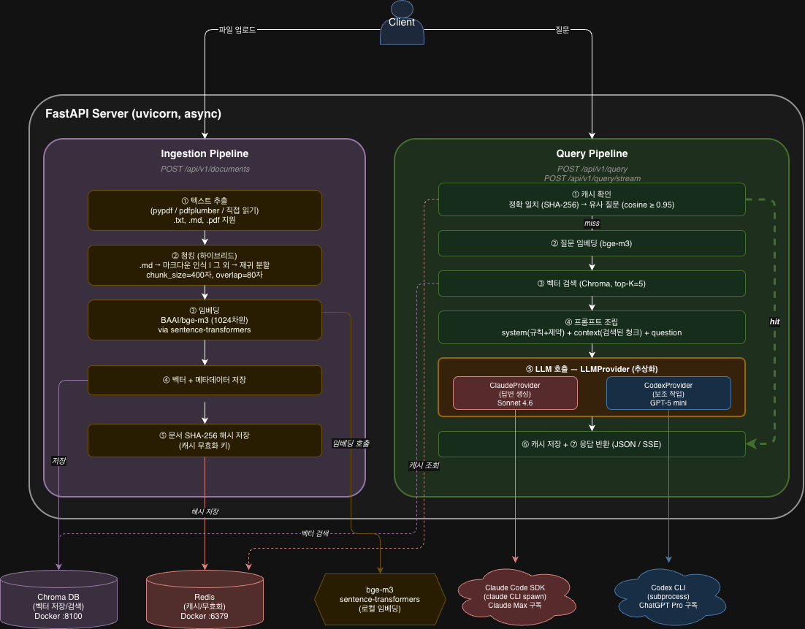

# ARCHITECTURE.md — Document Q&A API

## 1. 시스템 개요

문서를 업로드하면 텍스트를 추출·청킹·임베딩해서 벡터 DB에 저장하고,
사용자 질문에 대해 RAG(Retrieval-Augmented Generation)로 검색 후 LLM이 **출처와 함께** 답변을 생성하는 REST API 서버.

### 1.1 아키텍처 다이어그램



### 1.2 설계 원칙

| 원칙 | 적용 |
|------|------|
| 정확도 우선 | 임베딩(bge-m3)은 가장 정확한 모델 선택 (2.3GB이지만 감수) |
| 캐시로 속도 보완 | 동일/유사 질문은 LLM 호출 없이 즉시 반환 (3~15초 → 0ms) |
| 스트리밍으로 체감 대기 절감 | SSE로 토큰 단위 실시간 전송 |
| 데이터 기반 결정 | LLM 선택을 50케이스 평가로 측정 후 확정 |

RAG에 있어서, 가장 우선순위는 정확도라고 생각했습니다.
실무에서는 다양한 트레이드오프를 고려해야겠지만, 이번 과제에서는 비용보다 정확도를 우선했고, 속도 측면에서 LLM 호출이 느린 부분은 캐시와 스트리밍으로 보완하고자 고민하였습니다.
자체 평가 하네스를 기준으로 각 모델 및 툴의 성능을 비교해보며, 기술 스택을 결정하였습니다.

---

## 2. 기술 스택

| 영역 | 선택 | 버전 |
|------|------|------|
| 언어 | Python | 3.12 |
| 웹 프레임워크 | FastAPI + uvicorn | - |
| 임베딩 모델 | BAAI/bge-m3 (sentence-transformers) | - |
| 벡터 DB | Chroma | - |
| 캐시 DB | Redis | 7 |
| LLM (기본 답변) | Claude Sonnet 4.6 (claude-agent-sdk) | - |
| LLM (대안) | Codex (@openai/codex) | - |
| 컨테이너 | Docker Compose | - |

---

## 3. 기술 선택 근거

### 3.1 언어 / 프레임워크 — Python + FastAPI

RAG 생태계(sentence-transformers, chromadb, pypdf 등)가 Python에 집중되어있는 것을 확인했습니다.
FastAPI는 네이티브 async를 지원하므로 LLM 호출(3~15초) ~ 응답까지의 사용자 체감을 줄이고, 내부적으로는 다른 작업을 처리하고자 선택하였습니다.

| 후보 | 탈락 이유 |
|------|----------|
| Java + Spring Boot | RAG 라이브러리 부재 (임베딩 모델 로딩 어려움) |
| Node + NestJS | 임베딩/벡터 라이브러리 빈약, 한국어 모델 부족 |
| Rust + Axum | sentence-transformers 등가물 부재, PDF 추출 약함, 개발 속도 |

### 3.2 임베딩 모델 — BAAI/bge-m3

MTEB 한국어 Retrieval 벤치마크에서 최상위권인 것을 확인했습니다. - [MTEB Leaderboard](https://huggingface.co/spaces/mteb/leaderboard)*

**후보 비교**:

| 모델 | 차원 | 크기 | 최대 토큰 | 비고 |
|------|------|------|----------|------|
| **BAAI/bge-m3** | 1024 | 2.3GB | 8192 | MTEB 한국어 Retrieval 최상위권 |
| intfloat/multilingual-e5-base | 768 | 1.1GB | 512 | 입력 길이 제한 (긴 청크 절단) |
| jhgan/ko-sroberta-multitask | 768 | 442MB | 512 | 한국어 특화이나 다국어 약함 |

bge-m3을 선택한 이유는 두 가지입니다: **한국어 Retrieval 정확도 최상위권**과 **8192 토큰 입력 지원**.

크기가 2.3GB로 무겁지만, 이 과제에서는 비용보다 성능을 우선시 하고자 해당 모델을 선택했습니다.

처음에는 크기가 작고 한국어 특화인 ko-sroberta-multitask로 시작했으나, 두 가지 문제를 확인했습니다:
1. 영문 약어/기술 용어가 섞인 공공데이터 가이드라인(PDF)에서 검색 품질이 떨어짐
2. PDF 한 페이지가 800+ 토큰을 넘기는데, 512 토큰 제한 모델은 청크를 더 잘게 쪼개야 해서 문맥 손실이 큼

### 3.3 벡터 DB — Chroma

이 과제 규모(청크 50~500개)에서는 벡터 DB 간 성능 차이가 사실상 없다고 판단했습니다.
따라서 셋업이 가장 단순하고, 러닝 커브를 줄일 수 있는 Chroma를 선택했습니다.

| DB | 검색 속도 (50~500 벡터) | Docker 셋업 | Python 코드량 |
|----|----------------------|-------------|--------------|
| **Chroma** | <1ms | 1줄 | ~10줄 |
| Qdrant | <1ms | 1줄 | ~15줄 |
| pgvector | <1ms | 3줄 (확장 설치) | ~30줄 (SQLAlchemy) |

> 이 규모에서 세 DB 모두 <1ms로 성능 차이 없음. 벡터 100만 개 이상 시 Qdrant > Chroma > pgvector 순으로 성능 차이가 발생하나, 이 과제와 무관.

**Chroma의 추가 이점**:
- 임베디드 모드 지원 → 시드 스크립트에서 Docker 없이도 데이터 투입 가능
- 컬렉션 단위 삭제/재생성 → 캐시 무효화 구현 단순

### 3.4 캐시 DB — Redis

| 후보 | 탈락 이유 |
|------|----------|
| Memcached | 패턴 삭제 미지원 → `cache:exact:*` 일괄 무효화를 직접 구현해야 함 |
| SQLite | 디스크 I/O 기반이라 캐시 히트 시에도 ms 단위 지연. TTL도 직접 구현 필요 |
| 로컬 딕셔너리 | 서버 재시작 시 유실, 멀티 프로세스 공유 불가 |

처음에는 Memcached도 고려했지만, 문서 변경 시 `cache:exact:*` 패턴으로 캐시를 일괄 삭제해야 하는 무효화 요구사항 때문에 탈락했습니다. Memcached는 키를 개별로 알고 있어야 삭제할 수 있어서, 별도로 키 목록을 관리하는 로직이 필요했습니다.

Redis는 추가로, 문서 해시(`doc:hash:{filename}`)와 QA 캐시(`cache:exact:{hash}`)를 같은 인스턴스에서 관리할 수 있어서 인프라를 하나로 통합할 수 있었고, Chroma와 함께 `docker compose up -d` 한 줄로 실행되므로 과제의 한 줄 실행 조건에도 부합했습니다.

캐시 DB 요구사항:
- 동일 질문 캐시
- 유사 질문 캐시
- 문서 변경 시 무효화

위 3가지 사항을 별도 구현 없이 네이티브로 지원하고, Chroma와 함께 사용가능한 Redis를 캐시 DB로 선택하였습니다.
또한 KV 방식으로, 문서 해시 + QA 캐시를 같은 인스턴스에서 키만 분리하면 관리가 가능합니다.

| PRD 요구사항 | Redis 구현 방식 |
|-------------|----------------|
| 동일 질문 캐시 | 질문 해시 → Redis key (`cache:exact:{sha256}`), 답변 JSON → value, TTL 1시간 |
| 유사 질문 캐시 | 질문 임베딩 벡터를 별도 Chroma collection에 저장, cosine similarity ≥ 0.95이면 hit |
| 문서 변경 시 무효화 | 문서 SHA-256 해시 기반. 문서 재업로드 시 해시 비교 → 변경되었으면 `cache:exact:*` 전체 삭제 |

### 3.5 청킹 전략 — 파일 포맷별 하이브리드

파일 포맷마다 최적의 청킹 전략이 다르기 때문에 하이브리드로 구성했습니다.

| 파일 포맷 | 적용 전략 | 이유 |
|----------|----------|------|
| `.txt` | 재귀 분할 (Recursive) | 구분자 우선순위(`\n\n` → `\n` → `.` → ` `)로 자연 경계 보존 |
| `.md` | 마크다운 인식 (헤더 분할 → 재귀 fallback) | `##` 헤더가 섹션 경계 = 출처 추적에 최적 |
| `.pdf` | pypdf 추출 → 번호 헤더 마크다운 변환 → 마크다운 인식 | 번호 섹션(`1. 제목`)을 `##`로 변환하여 .md와 동일 파이프라인 재활용 |

**청킹 파라미터**: chunk_size=400자, overlap=80자

#### PDF 청킹 전략 비교 (실측)

PDF에서 재귀 분할 vs 마크다운 인식 청킹의 차이를 동일 문서/질문으로 측정:

**테스트 조건**: `public-data-quality-guide.pdf` (41페이지, 한국어 정부 문서) + Claude Sonnet 4.6 + 동일 질문 5개

| 메트릭 | 재귀 분할 (Before) | 마크다운 인식 (After) | 변화 |
|--------|----------------|----------------|------|
| 청크 수 | 175개 | 175개 | 동일 |
| section 메타데이터 | `""` (빈 문자열) | 헤더 경로 보존 | **개선** |
| 정답률 (5문제) | 5/5 (100%) | 5/5 (100%) | 동일 |
| 평균 응답 속도 | ~8.0초 | ~6.2초 | **-22% 개선** |
| Q3 불완전성 안내 | "청크 잘려있어 원문 확인 권장" | 없음 (깔끔한 답변) | **TS-006 해결** |
| 코드 변경량 | - | +17줄 | 최소 |

같은 청크 수(175개)인데도 응답 속도가 22% 빨라진 이유는, 섹션 단위로 경계를 맞추면 법률/규정 같은 긴 문단이 잘리지 않아서 검색 시 더 관련성 높은 청크가 상위에 올라오기 때문입니다.

#### 마크다운 청킹 초기 문제 (TS-002 → 해결)

초기에는 짧은 섹션(23자)이 별도 청크로 분리되어 검색 품질이 떨어지는 문제가 있었습니다:

| 문서 | 글자 수 | 초기 청크 | 최소 청크 | 평균 크기 |
|------|---------|----------|----------|----------|
| `01-rag-overview.md` | 4,746자 | 28개 | 23자 | 156자 |
| `development-guide.md` | 615자 | 5개 | 69자 | 107자 |

**해결**: 인접 섹션 병합 로직 추가 (100자 미만 섹션 → 다음 섹션과 병합) → 28개 → 21개 청크, 평균 156자 → 208자.

> 자세한 실험 조건: [docs/TROUBLESHOOTING.md](./docs/TROUBLESHOOTING.md) TS-002, TS-006 참조.

### 3.6 LLM SDK — Claude Code SDK + Codex CLI

`LLMProvider` 인터페이스 1개에 어댑터 2개(ClaudeProvider, CodexProvider)를 붙여서, `.env` 값 하나로 모델을 바꿀 수 있게 했습니다.

처음에는 자동 평가에서 Codex가 거절 정확도 100% + 속도 2.4배로 우세해서 Codex를 기본으로 선택했습니다. 그런데 실제 UI에서 같은 질문 5개를 양쪽으로 비교해보니, Claude의 답변이 번호/불릿/볼드로 구조화되어 있고 Codex는 1~2줄 평문이었습니다. 정답률이 같다면 읽기 편한 쪽이 낫다고 판단해서 Claude로 바꿨습니다.

이후 프롬프트 v3(Few-shot + 동의어 금지)를 적용하니 Claude의 거절 정확도도 100%에 도달해서, 속도를 제외한 모든 영역에서 Claude가 Codex 이상입니다. 속도 차이(8.8초 vs 4.5초)는 캐시 히트 시 0ms + SSE 스트리밍으로 보완합니다.

| 역할 | 모델 | 근거 |
|------|------|------|
| 기본 답변 | Claude | 답변 구조화, 가독성, Refusal 100% (v3 기준) |
| 대안 (속도 우선) | Codex | 속도 2.4배 빠름, .env 한 줄로 전환 가능 |

> UI 비교 스크린샷: `eval/images/` 참조
> 상세 분석: [PROMPT_DESIGN.md](./PROMPT_DESIGN.md) 4장

---

## 4. API 설계

### 4.1 엔드포인트

| Method | Path | 역할 | 응답 |
|--------|------|------|------|
| `POST` | `/api/v1/documents` | 문서 업로드 | JSON |
| `GET` | `/api/v1/documents` | 문서 목록 | JSON |
| `POST` | `/api/v1/query` | 질의응답 | JSON |
| `POST` | `/api/v1/query/stream` | 질의응답 (스트리밍) | SSE |
| `GET` | `/health` | 헬스체크 | JSON |

### 4.2 응답 형식

**질의응답 응답** (`POST /api/v1/query`):

```json
{
  "data": {
    "answer": "입사 3년차 직원의 연차는 16일입니다.",
    "sources": [
      {
        "file": "company-policy.txt",
        "chunk_id": 3,
        "text": "입사 1년 이상: 연 15일 (근속 2년마다 1일 추가, 최대 25일)"
      }
    ],
    "answerable": true,
    "cached": false,
    "model": "claude-sonnet-4-6",
    "latency_ms": 3200
  }
}
```

**문서에 답이 없는 경우**:

```json
{
  "data": {
    "answer": "제공된 문서에서 해당 내용을 찾을 수 없습니다.",
    "sources": [],
    "answerable": false,
    "cached": false,
    "model": "claude-sonnet-4-6",
    "latency_ms": 2100
  }
}
```

### 4.3 에러 응답

```json
{
  "error": {
    "code": "DOCUMENT_NOT_FOUND",
    "message": "요청한 문서를 찾을 수 없습니다.",
    "details": []
  }
}
```

---

## 5. RAG 파이프라인 상세

### 5.1 Ingestion (문서 수집)

```
원본 파일 업로드
    ↓
① 텍스트 추출 (pypdf + 마크다운 변환 / 직접 읽기)
    ↓
② 청킹 (하이브리드: .md → 마크다운 인식, 그 외 → 재귀 분할)
    ↓
③ 임베딩 (bge-m3 via sentence-transformers)
    ↓
④ Chroma에 벡터 + 원본 텍스트 + 메타데이터 저장
    ↓
⑤ Redis에 문서 SHA-256 해시 저장 (캐시 무효화 키)
```

**지원 포맷**: `.txt`, `.md`, `.pdf` (최소 2개 이상 — PRD 충족)

### 5.2 Query (질의응답)

```
사용자 질문 도착
    ↓
① 캐시 확인 (Redis — 정확 일치 + 유사 질문)
    ├─ hit → ⑦로 직행 (LLM 호출 건너뜀)
    └─ miss ↓
② 질문 임베딩 (bge-m3)
    ↓
③ Chroma 벡터 검색 (top-K, K=5)
    ↓
④ 프롬프트 조립 (system + context + question)
    ↓
⑤ LLM 호출 (LLMProvider → Claude/Codex)
    ↓
⑥ 캐시 저장 (질문 해시 + 임베딩 + 답변)
    ↓
⑦ 응답 반환 (JSON or SSE)
```

### 5.3 캐시 무효화

문서가 업로드(신규/변경)되면 전체 QA 캐시를 삭제합니다. 처음에는 파일별로 관련 캐시만 삭제했지만, 신규 문서 추가 시 이전 거절 답변이 캐시에 남는 문제(TS-008)가 있어서 전체 삭제로 전환했습니다. 문서 업로드 빈도가 질의보다 훨씬 낮으므로 실용적인 선택입니다.

```
문서 업로드 시:
    ↓
① 새 파일의 SHA-256 계산
    ↓
② Redis에 저장된 이전 해시와 비교
    ├─ 동일 → "이미 최신" 반환 (재처리 안 함)
    └─ 변경됨 또는 신규 ↓
③ 전체 QA 캐시 삭제 (Redis cache:exact:* + Chroma cache_questions)
    ↓
④ 기존 벡터 삭제 (변경 시만) → 새 파일로 Ingestion 재실행
```

---

## 6. 프로젝트 구조

```
officeagent-onboarding-challenge/
├── app/
│   ├── __init__.py
│   ├── main.py                 # FastAPI 앱 진입점
│   ├── config.py               # pydantic-settings 설정
│   ├── schemas.py              # Pydantic 요청/응답 모델
│   ├── api/
│   │   ├── deps.py             # FastAPI Depends 팩토리
│   │   └── routers/
│   │       ├── ingest.py       # 문서 업로드 API
│   │       ├── query.py        # 질의응답 API (JSON + SSE)
│   │       └── health.py       # 헬스체크
│   ├── services/
│   │   ├── ingest_service.py   # Ingestion 비즈니스 로직
│   │   ├── rag_service.py      # RAG 파이프라인 조율
│   │   └── cache_service.py    # 캐시 조회/저장/무효화
│   ├── llm/
│   │   ├── provider.py         # LLMProvider ABC
│   │   ├── claude_provider.py  # Claude Code SDK 어댑터
│   │   └── codex_provider.py   # Codex CLI 어댑터
│   ├── extraction/
│   │   └── text_extractor.py   # 포맷별 텍스트 추출 (.txt/.md/.pdf)
│   ├── chunking/
│   │   ├── router.py           # 포맷별 청킹 전략 분기
│   │   ├── recursive.py        # 재귀 분할 청킹
│   │   └── markdown.py         # 마크다운 인식 청킹 (헤더 기반)
│   ├── embedding/
│   │   └── embedder.py         # sentence-transformers 래퍼
│   ├── vectorstore/
│   │   └── chroma_store.py     # Chroma 클라이언트
│   ├── cache/
│   │   └── redis_cache.py      # Redis 캐시 클라이언트
│   └── prompts/
│       └── templates.py        # 프롬프트 템플릿
├── eval/
│   ├── golden_dataset.json     # 골든 데이터셋 (50케이스)
│   ├── run.py                  # 평가 실행 스크립트
│   └── metrics.py              # 메트릭 계산
├── tests/
│   ├── unit/
│   └── integration/
├── scripts/
│   └── seed.sh                 # 샘플 문서 시드
├── docs/
│   └── images/                 # 벤치마크 스크린샷
├── docker-compose.yml
├── Dockerfile
├── pyproject.toml
├── .env.example
├── ARCHITECTURE.md             # ← 이 파일
├── PROMPT_DESIGN.md            # 프롬프트 설계 (별도 작성)
└── README.md                   # 실행 방법 + 요약
```

---

## 7. 실행 방법

```bash
# 한 줄 실행 (CLI 자동 감지 + .env 생성 + 서버 시작 + 샘플 업로드)
chmod +x start.sh && ./start.sh

# 개발 모드 (단계별)
docker compose up -d chroma redis   # DB만 컨테이너
python3 -m venv .venv && source .venv/bin/activate
pip install -e .
cp .env.example .env
uvicorn app.main:app --reload --port 8000
```

> start.sh가 설치된 LLM CLI(claude/codex)를 자동 감지하여 `.env`의 `LLM_ANSWER_PROVIDER`를 설정.

---

## 8. 평가 하네스

### 8.1 목적

기술 선택과 프롬프트 튜닝을 직감이 아니라 데이터로 결정하기 위해 만든 자체 평가 시스템입니다. 초기 20케이스에서 모델 간 차이가 안 나와서 50케이스로 확장했고, 난이도 유형도 7가지로 세분화했습니다.

### 8.2 골든 데이터셋

sample-docs 6개 파일에서 추출한 50개 케이스:
- easy: 16개, medium: 11개, computation: 4개 (수치 계산)
- multi-hop: 2개 (정보 조합), edge/함정: 6개, long-answer: 1개
- unanswerable: 6개 (문서에 답이 없는 질문 — 거절 테스트)
- 초기 20케이스(simple docs)에서 모델 차이 미발견 → 50케이스로 고도화

### 8.3 메트릭

| 메트릭 | 측정 방법 | 목표 |
|--------|----------|------|
| Retrieval Hit Rate | 검색된 top-K 청크에 정답 출처 포함? | ≥ 0.85 |
| Citation Accuracy | 답변이 인용한 출처가 정확? | ≥ 0.80 |
| Refusal Accuracy | 답 없는 질문에 "모름" 응답? | ≥ 0.90 |
| Keyword Hit Rate | 답변에 기대 키워드 전부 포함? | ≥ 0.80 |
| JSON Parse Rate | 구조화 출력 파싱 성공률 | ≥ 0.95 |
| Latency p50 | 응답 시간 중앙값 | < 10초 |
| Latency p95 | 응답 시간 95퍼센타일 | < 20초 |

### 8.4 측정 결과 (최신 — v3 프롬프트 적용 후)

| 메트릭 | Claude v3 | Codex | 목표 | 달성 |
|--------|----------|-------|------|------|
| Retrieval Hit Rate | **97.73%** | 90.91% | ≥ 85% | **달성** |
| Citation Accuracy | **97.73%** | 90.91% | ≥ 80% | **달성** |
| Refusal Accuracy | **100.00%** | 100.00% | ≥ 90% | **달성** |
| Keyword Hit Rate | 88.64% | 90.91% | ≥ 80% | **달성** |
| JSON Parse Rate | 100.00% | 100.00% | ≥ 95% | **달성** |
| Latency p50 | 8,803ms | **4,516ms** | < 10초 | **달성** |
| Latency p95 | 15,731ms | **10,557ms** | < 20초 | **달성** |

> 측정 조건: golden_dataset 50케이스, 문서 6개. v3 프롬프트 (Few-shot + 이중 방어) 적용.
> v2→v3 핵심 개선: Refusal 83%→100%, Retrieval 93%→98%.
> 상세 분석: [PROMPT_DESIGN.md](./PROMPT_DESIGN.md) 4장

---

## 9. 캐싱 전략 상세

### 9.1 3단계 캐시

| 단계 | 방식 | 키 | TTL |
|------|------|-----|-----|
| 1. 정확 일치 | 질문 텍스트 SHA-256 → Redis key | `cache:exact:{hash}` | 1시간 |
| 2. 유사 질문 | 질문 임베딩 → Chroma `cache_questions` collection → cosine ≥ 0.95 | 임베딩 벡터 | 1시간 |
| 3. 무효화 | 문서 업로드(추가/변경) 시 **전체 QA 캐시 삭제** | `doc:hash:{filename}` | 없음 |

### 9.2 캐시 히트 흐름

```
질문 도착
  ↓
[1단계] SHA-256(질문) → Redis 조회
  ├─ hit → cached=true 응답 반환
  └─ miss ↓
[2단계] embed(질문) → Chroma cache_questions에서 cosine ≥ 0.95 검색
  ├─ hit → cached=true 응답 반환
  └─ miss → RAG 파이프라인 실행 → 결과를 1단계 + 2단계에 저장
```

### 9.3 자체 측정 결과

**테스트 조건**: `public-data-quality-guide.pdf` + Claude Sonnet 4.6 + 질문 "데이터 이관 검증 시 컨설팅사업에서 도출해야 할 요건은?"

| 시나리오 | 응답 시간 | 비고 |
|----------|----------|------|
| 캐시 miss (LLM 호출) | **13,636ms** | 전체 RAG 파이프라인 (임베딩 + 벡터 검색 + LLM 생성) |
| 정확 일치 hit | **0ms** (캐시) | Redis 조회만 — 사용자 체감 즉시 응답 |

캐시 hit 시 LLM 호출 자체를 건너뛰기 때문에, 동일 질문은 사실상 즉시 응답됩니다.

---

## 10. 향후 개선 방향

> 8일 기한 내 구현하지 못한 부분 또는 추가 개선 가능성을 기록.

- [ ] HyDE (Hypothetical Document Embeddings) — 짧은 질문의 검색 품질 향상
- [ ] Reranking — 검색 결과를 LLM/cross-encoder로 재정렬
- [ ] Multi-Query — 질문을 여러 표현으로 변형해 검색 누락 감소
- [ ] 하이브리드 검색 (벡터 + BM25 키워드) — 고유명사/숫자 검색 보강
- [ ] Self-check — 답변 생성 후 LLM으로 자기 검증 (환각 추가 억제)
- [ ] 대규모 문서 지원 — Qdrant 전환, 배치 임베딩
- [ ] 캐시 무효화 고도화 — 현재 전체 무효화 → Corpus 버전 태깅(문서별 선택적 무효화)으로 전환. 문서 추가 빈도가 높아지면 전체 캐시 삭제 비용 증가하므로, `corpus:version` Redis 키로 lazy invalidation 적용
- [ ] Chroma 캐시 LRU 제한 — 현재 `cache_questions` 컬렉션이 무제한 증가. 장기 운영 시 최근 N건(예: 1000건)만 유지하도록 LRU 정책 적용
- [ ] LLM 호출 재시도 로직 — 일시적 네트워크/CLI 오류에 대해 지수 백오프 3회 재시도 (현재는 즉시 raise)
- [ ] Prompt caching — `claude-agent-sdk`의 `cache_control` 지원 확인 후, system 프롬프트 + 문서 청크 캐싱으로 토큰 비용 30~50% 절감 가능
- [ ] 문서 삭제 API — `POST /api/v1/documents/{filename}/delete` + 관련 벡터/캐시 정리
